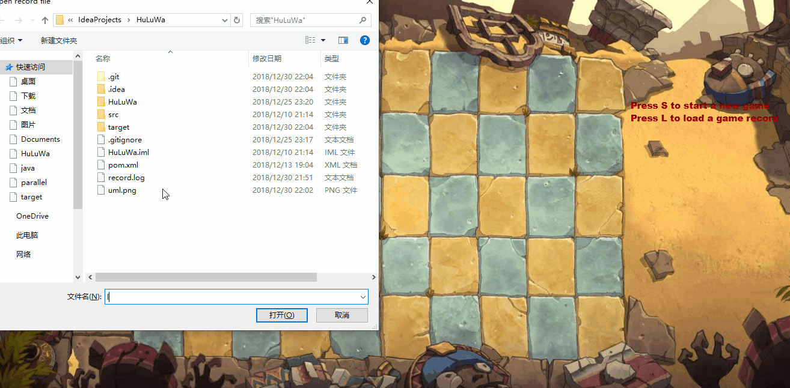
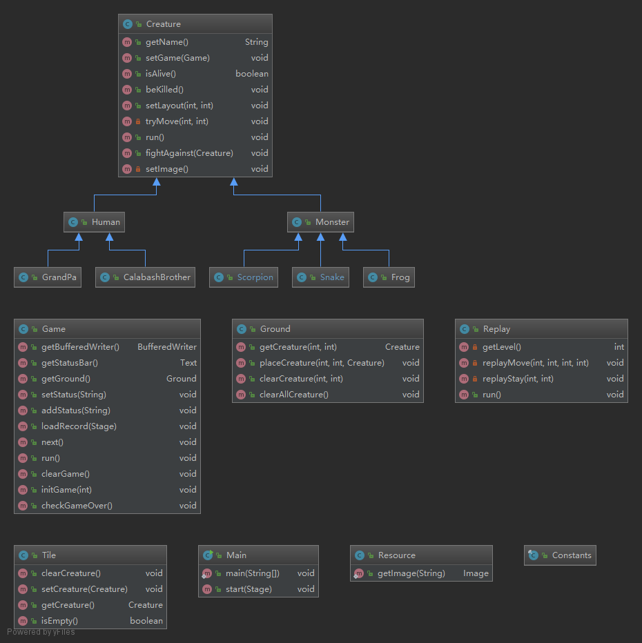

# 葫芦娃大战妖精

## 效果图



## 构建与运行

```(bash)
git clone git@github.com:xulj-cs/HuLuWa.git
cd HuLuWa
mvn clean test package
java -jar target/HuLuWa-1.0.jar
```

## 游戏介绍

此游戏并非真正的“游戏”：玩家并不具有真正控制游戏角色行动的能力。
游戏阵营分为`Human`和`Monster`,游戏结束条件是某一方角色全部阵亡。
本游戏有多个关卡（`LEVEL`),每个关卡双方具有不同的阵法（`ZhenFa`）。
游戏具有基本的记录和回放（`replay`）功能。

当不同阵营的双方试图进入同一位置时，会进行`Fight`,结果有且只有一个生物存活，另一个生物死亡。

## 游戏操作

本游戏为按键操作，操作指南如下：

- S ：加载游戏阵法
- SPACE ：开始游戏
- N ：进入下一关卡
- L ：加载游戏记录，进行回放
  
## 类图



## JavaFx

本次使用的GUI框架是JavaFx：

- `Parent`节点使用的是子类`Pane`，方便调整子节点位置；
- 所有生物`Creature`均继承自`ImageView`，利用`setImage`方法来设置图像，利用`setLayoutX/Y`方法来实现移动`move`操作
- 状态栏`statusBar`是`Text`实例，用来显示游戏的状态输出和按键提示

## 用到的Java知识

- 继承与多态
  
  生物体`Creature`用到了继承和多态，这是纯粹的subtype

- RTTI

  在区分Human/Monste时，用到了`instanceOf`关键字，这是java的RTTI机制

- 集合框架

  为了方便管理多个生物体，利用了`ArrayList`集合框架

- 多进程

  生物体`Creature`实现了`Runnable`接口。当游戏开始时，每个生物具有一个线程，这里线程的执行用到了`newFixedExecutePool`，减小线程开销。为了防止线程处突，对临界区利用`synchronized`关键字进行互斥访问

- 输入输出

  为了游戏的记录和加载，这里用到了文件的输入输出，`FileWriter`以及`FileReader`

- 异常处理

  对于`IO`处理的`IO`异常和多线程的`sleep`操作的`Interrupted`异常，用到了`try-catch-finally`来进行异常处理

- 注解

  使用`@Override`检查方法覆盖，使用`@Test`进行单元测试

- 测试与构建

  利用Maven来进行项目自动化测试和构建；利用Junit进行单元测试

- 设计模式
  
  装饰器模式：在IO操作时，用`BufferedWriter`来装饰`FileWriter`，以及对应的`BufferedReader`来装饰`FileReader`

  代理模式：通过组合来实现功能的代理

## 致谢

本项目中图像资源采用自[tangruize/huluwa](https://github.com/tangruize/huluwa)